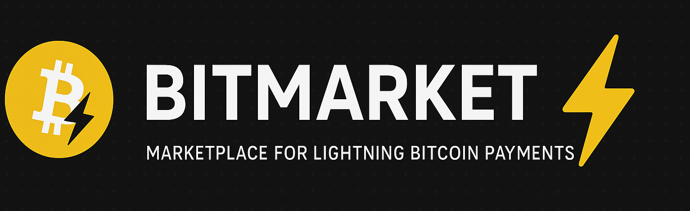

<p align="center">
  
  <h1 align="center">BitMarket</h1>
  <p align="center">A Bitcoin Lightning Network Marketplace built with NestJS</p>
</p>

<p align="center">
  <a href="LICENSE" target="_blank"></a>
  <a href="https://nestjs.com" target="_blank"></a>
  <a href="https://nodejs.org" target="_blank">= 18" /></a>
  <a href="https://www.postgresql.org" target="_blank"></a>
  <a href="https://lightning.network" target="_blank"></a>
</p>

## 📋 Description

BitMarket is a marketplace platform that supports Bitcoin Lightning Network payments, allowing users to buy and sell products with cryptocurrency or traditional fiat currencies.

### ✨ Features

- 🔐 **User Authentication**: Secure JWT-based authentication system
- 📦 **Product Management**: List, view, create, update and delete products
- 🛒 **Order Management**: Create and manage orders
- 💰 **Multiple Currency Support**: Prices in BRL, USD, or SATS (Bitcoin satoshis)
- ⚡ **Bitcoin Lightning Network Integration**: For fast and low-cost transactions

## 🚀 Quick Start

### Prerequisites

- [Node.js](https://nodejs.org/) (>=18.x)
- [PNPM](https://pnpm.io/) (>=8.x)
- [PostgreSQL](https://www.postgresql.org/) (>=14.x)

### Environment Setup

1. Clone the repository
2. Create a `.env` file in the root directory based on the following template:

```bash
# Database Configuration
DB_HOST=localhost
DB_PORT=5432
DB_USER=postgres
DB_PASSWORD=postgres
DB_NAME=bitmarket

# JWT Configuration
JWT_SECRET=your_jwt_secret_should_be_complex_and_unique
JWT_EXPIRATION=1d

# Server Configuration
PORT=3000
NODE_ENV=development
```

### Installation

```bash
$ pnpm install
```

### Running the app

```bash
# development
$ pnpm run start

# watch mode
$ pnpm run start:dev

# production mode
$ pnpm run start:prod
```

## 🧪 Testing

```bash
# unit tests
$ pnpm run test

# e2e tests
$ pnpm run test:e2e

# test coverage
$ pnpm run test:cov
```

## 📡 API Documentation

Once the application is running, you can access the Swagger API documentation at:

```
http://localhost:3000/api
```

### Available Endpoints

The API includes endpoints for:

- **Authentication**: Register, login, and JWT protected routes
- **Products**: Create, read, update, and delete products
- **Orders**: Manage purchase orders

## 📁 Project Structure

```
src/
├── auth/           # Authentication module (JWT, strategies, guards)
├── users/          # User management
├── products/       # Product catalog and management
├── orders/         # Order processing
└── main.ts         # Application entry point
```

## 🚢 Deployment

For production deployment:

1. Set `NODE_ENV=production` in your environment
2. Ensure proper security settings for JWT_SECRET
3. Configure a production-ready database
4. Run `pnpm run build` followed by `pnpm run start:prod`

## 🛠️ Development Tools

- **REST Client**: The project includes Bruno API client files in the `rest-client` directory for testing endpoints

## 🤝 Contributing

Contributions are welcome! Please feel free to submit a Pull Request.

## 📄 License

This project is licensed under the MIT License - see the LICENSE file for details.
